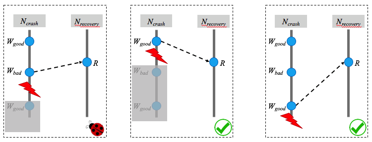

#  Fundamental principle
TOF, a nondeterminism culprit, introduces new define-use relations between _W_ and _R_ beyond traditional concurrency.

# TOF bug categorization

|:---:|:---:|:---:|
| _Conflicting_ | _R_Regular | _R_Recovery |
| _W_Crash | **Crash-regular TOF bug** | **Crash-recovery TOF bug** |

* _W_Crash: _W_ from[^1] the crash node
* _R_Regular: _R_ from[^1] a non-crash node
* _R_Recovery: _R_ from[^1] the recovery node

---

# Crash-regular TOF bugs
*  How can TOF determine the content consumed by _R_Regular?
    * _R_Regular happens-before _W_Crash? :worried:
    * _W_Crash happens-before _R_Regular? :yum:
    * _W_Crash concurrent with _R_Regular? :worried:

---

# Crash-recovery TOF bugs
*  The content consumed by _R_Recovery is **completely** determined by TOF.

---
[^1]: "from" means _W_/_R_ physically executes on the node **or** casually initiated by the node.
